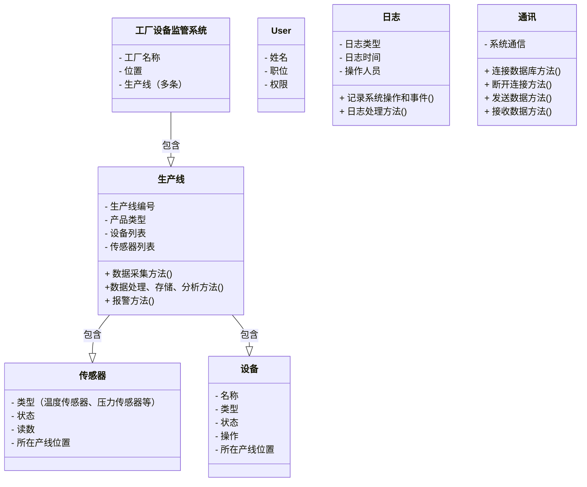
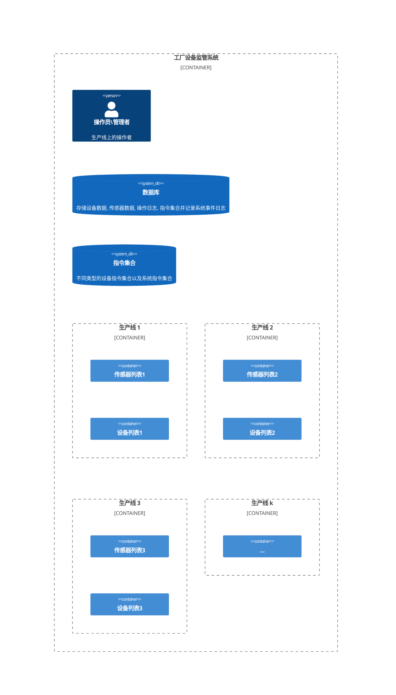

## 基础图纸

## 概念
> 上位机（Host Computer, Master or Supervisor）是一个通常用于监控和控制生产线、工厂设备或工业自动化系统的计算机。上位机与下位机（被控制设备，如生产线上的设备、机器人等）相互配合，通过通信协议（如Modbus、CAN、以太网等）进行数据交换和指令传输。

上位机的主要职责包括：

1. 监控和控制：上位机可以实时监控下位机的状态和数据，并对其发送控制命令，如启动、停止、调整参数等。
2. 数据采集与处理：上位机可以收集下位机的数据，如传感器读数、设备状态等，并对这些数据进行处理、分析和存储。
3. 故障诊断与报警：上位机可以对下位机发出的故障或异常信号进行诊断，并采取相应措施，如发出报警、停止设备等。
4. 人机界面（HMI）：上位机通常提供一种人机界面，以便操作员和管理员监控系统状态、控制设备、查看数据报表等。
5. 通信：上位机负责与下位机以及其他相关系统（如数据库、ERP系统等）之间的通信，确保数据的准确传输和系统之间的协同工作。

!!! info
    上位机可以是一台工业计算机、PC、服务器甚至嵌入式设备，具体取决于所需的功能和性能。上位机软件可以使用各种编程语言（如C/C++、Python、Java等）和开发工具（如LabVIEW、WinCC、Ignition等）进行开发。

## 基础类

## 系统框架

